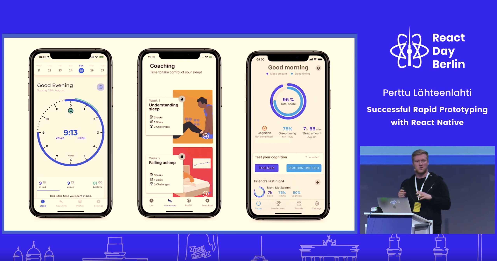

This is a transcript of a lightning talk I gave at React Day Berlin in 2019. You can watch the talk [here](https://www.youtube.com/embed/QafikEOSUGA), and download the presentation slides [here](ReactDayBerlin19.pdf). All the links resources are available at the end of this transcript.

But before we go into all that, I want to give a little introduction to myself. So the reason for my complicated name "Perttu Lähteenlahti" is because I'm from Finland, which is by the way celebrating its Independence Day today. I'm a developer/designer at a company called Nyxo, where we build personalized sleep coaching programs in a mobile app format.

The reason I know a lot about prototypes is because I've taken part in around 70 hackathons, which are, in a way, prototyping competitions. I've won about 40 of those, so I've been moderately successful.

But let's get to the subject at hand, so why prototype? Reasons for doing that could be simply that:
You're starting from scratch
You want to try out new technology
You're unsure of the path the product is going to take
Generally speaking, prototyping is something you do every time you're unsure what you're supposed to do. That's precisely the place where I started about a year ago when I was hired by two university research to commercialize their sleep research. I went to the first meeting, and the conversation went a little like this:

**Researchers:** _"build us a product."_

**Me:** _"can you be more specific?"_

**Researchers:** _"build as a product that is nice to use and makes money."_

I was like that doesn't make it any more apparent, but then I decided that I might as well start by building a prototype.

I ended up building these three prototypes. In the one you see on the left of the picture, we decided to experiment with how people would like to see their sleep data. What kind of presentation types work and which do not.

In the middle one, we tested out how you should provide sleep coaching content, which means, e.g., how to show exercises and lessons that are engaging and interesting to go through.

And on the right one, we tested that if you could make sleeping into a game so every night you would try to sleep better than your friends and that way compete against your friends.

When I was researching how to build these prototypes, I had one hard requirement: I have able to take part in the coding as well. Because I have a background in design and web development, native iOS or Android weren't a viable option. React Native turned out to be a kind of a perfect solution for that. But not just because it's suitable for prototyping but because I could also use it to build the end product. This transition is possible because building with React Native is relatively straightforward to build with it. It's also really fast to build with it, and it's even faster to deliver and measure everything.

## Building

Let's look at why is building apps with React Native is so swift. For starters, the are many great UI kits such as react-native-paper. I like to build UIs myself. Mainly because I will then know how every component is built, and can then use them more effectively. In general, React Native allows you to build cool stuff fast just because you can employ your existing skills from React and JavaScript so much.

## Delivering

What is maybe even cooler is delivering fast. React Native's capability to deliver fast actually saved our butts when we were testing one of our pilot products with the largest life insurance company in Finland. One Friday I got an email that said:

"hey, this feature we agreed on doesn't work for me."

Reading that email, I was like we never agreed on that feature. It was never supposed to be in this pilot. However, instead of arguing over email, I instead decided to try if I could fix things without anyone noticing. So during the weekend, I built the feature and released it before Monday. Without React Native that would not have been possible, because the usual way you do it through App Store connect and Play Store is really painful it takes many days for Apple to look at but using Codepush we were able to update the code. The users didn't even notice that the feature was missing. The following Monday I got an email saying "sorry it might have been my device that it didn't work."

Expo is a pretty good solution, also offering you the same capabilities of pushing your code over-the-air as CodePush.

Last but not least, there's also react-native-remote-config that is part of React Native Firebase. It isn't as powerful as Codepush or Expo, but still allows you to make changes on the fly, but only in the configuration as you can change the JavaScript bundle by using this. It is still worth considering, especially if you're already using Firebase in your project.

## Analytics

Before becoming a product designer/developer, I was a carpenter for seven years. There we used the mantra "measure twice" a lot. However, when I transitioned to the technology world, this mantra turned into a "measure everything". Measure what the user is doing, how long they are doing it, and what they are doing. Because in prototyping, your progress is only as good as results and feedback you get you. To do that, use the following tools.

**Amplify analytics from AWS**

**Firebase Analytics**

**App Center Analytics (we use this mostly)**

Here is also one hack that reveals some hidden user behavior. Wrap all the components with different <TouchableWithoutFeedback/> components and make them emit and analytics event when the user clicks them. It allows you to understand which parts of the screen users are pressing, and for example, reveals if they consider something to be clickable that is not. In our case, it showed both UX problems as well and potential new features. However, please don't do this in production; it's terrible for accessibility.

This concludes my lightning talk on Successful rapid prototyping.

- Build fast with
  - [React Native Paper](https://reactnativepaper.com/)
- Deliver fast
  - [Expo](https://expo.io)
  - [CodePush](https://github.com/Microsoft/code-push)
  - [Remote Config](https://invertase.io/oss/react-native-firebase/v6/remote-config)
- Measure everything.
  - [AWS Amplify](https://aws-amplify.github.io/)
  - [App Center](https://appcenter.m)
  - [Firebase](https://rnfirebase.io/docs/v5.x.x/analytics/ios)
